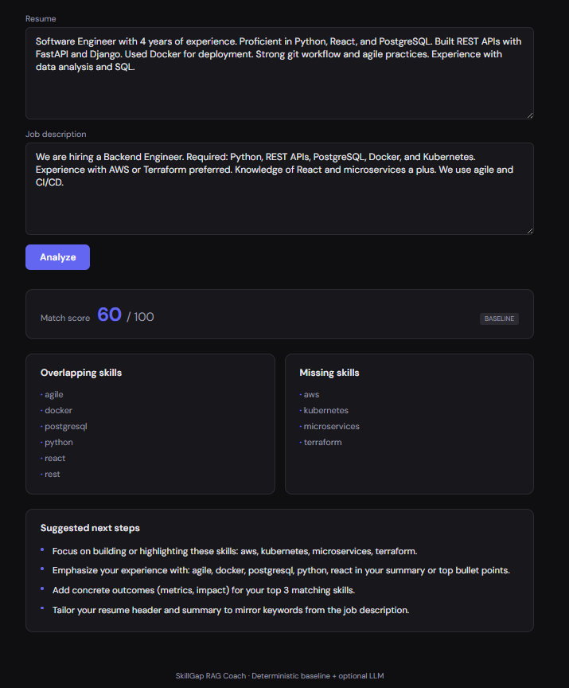

# SkillGap RAG Coach

A web app that takes a user’s **resume text** and a **job description**, extracts and normalizes skills, computes a **match score**, and suggests **missing skills** plus an **improvement plan**. No API keys required for the baseline; optional LLM mode for richer suggestions.

---

## What it does

- **Input:** Two text areas — paste your resume and the job description.
- **Output:**
  - **Match score** (0–100): percentage of job skills found in your resume.
  - **Overlapping skills:** Skills that appear in both.
  - **Missing skills:** Skills from the job that we didn’t find in your resume.
  - **Suggested next steps:** A short, actionable bullet plan to improve your fit.

The app runs a **deterministic baseline** (keyword/skill dictionary + scoring) by default, so it works with **no external API keys**. You can optionally enable **LLM mode** (via `OPENAI_API_KEY` + `USE_LLM_MODE=true`) for AI-generated improvement suggestions.

---

## Architecture (high level)

```
┌─────────────────────────────────────────────────────────────────────────┐
│                           User browser                                   │
│  ┌───────────────────────────────────────────────────────────────────┐  │
│  │  Next.js (React + TypeScript)  │  Port 3000                        │  │
│  │  - Two text areas: Resume + Job Description                        │  │
│  │  - Submit → POST /analyze → display score, skills, next steps     │  │
│  └───────────────────────────────────────────────────────────────────┘  │
└─────────────────────────────────────────────────────────────────────────┘
                                        │
                                        │ HTTP POST /analyze
                                        ▼
┌─────────────────────────────────────────────────────────────────────────┐
│  FastAPI backend  │  Port 8000                                           │
│  - POST /analyze: resume_text + job_description                          │  │
│  - Skill extraction (dictionary + normalization)                         │  │
│  - Match score (job skills found in resume)                               │  │
│  - Optional: LLM (OpenAI) for suggested_next_steps if key set             │  │
│  - Returns JSON: match_score, overlapping_skills, missing_skills, steps   │  │
└─────────────────────────────────────────────────────────────────────────┘
                                        │
                                        │ (optional future: store runs)
                                        ▼
┌─────────────────────────────────────────────────────────────────────────┐
│  Postgres  │  Port 5432                                                  │  │
│  - Used by Docker Compose; ready for persistence (e.g. analysis history)  │  │
└─────────────────────────────────────────────────────────────────────────┘
```

- **Frontend:** Next.js (React + TypeScript), single page with form and results.
- **Backend:** Python FastAPI; baseline logic in `services/baseline.py`, optional LLM in `services/llm_service.py`.
- **DB:** Postgres in Docker; app works without DB for MVP (no persistence required for analyze).

---

## Screenshots

<!-- Add a screenshot of the main page here -->
<!--  -->

<!-- Add a screenshot of the results view here -->
<!--  -->

---

## Setup

### Prerequisites

- **Docker** and **Docker Compose**
- (Optional) **Node 20+** and **Python 3.12+** for local runs without Docker

### 1. Dockerized local dev (recommended)

From the project root:

```bash
docker compose up
```

This starts:

- **Postgres** on `localhost:5432`
- **Backend** on `http://localhost:8000`
- **Frontend** on `http://localhost:3000`

Open [http://localhost:3000](http://localhost:3000), paste resume and job description, and click **Analyze**.

### 2. Backend only (local Python)

```bash
cd backend
cp .env.example .env   # edit if needed
pip install -r requirements.txt
# Ensure Postgres is running (e.g. via Docker: docker compose up db -d)
uvicorn main:app --reload --host 0.0.0.0 --port 8000
```

### 3. Frontend only (local Node)

```bash
cd frontend
cp .env.example .env
npm install
npm run dev
```

Set `NEXT_PUBLIC_API_URL=http://localhost:8000` in `.env` so the frontend talks to your backend.

### 4. Optional LLM mode

- Set `OPENAI_API_KEY` in the backend environment (e.g. in `.env` or `docker-compose`).
- Set `USE_LLM_MODE=true`.
- Restart the backend; suggested next steps will use OpenAI (fallback to baseline on failure).

---

## API docs

### Base URL

- Local: `http://localhost:8000`
- OpenAPI (Swagger): `http://localhost:8000/docs`

### Endpoints

| Method | Path      | Description                |
|--------|-----------|----------------------------|
| GET    | `/health` | Health check               |
| POST   | `/analyze`| Analyze resume vs job      |

### POST /analyze

**Request body (JSON):**

```json
{
  "resume_text": "Your full resume text...",
  "job_description": "Full job description text..."
}
```

**Example response (200):**

```json
{
  "match_score": 67,
  "overlapping_skills": ["python", "react", "postgresql"],
  "missing_skills": ["kubernetes", "aws"],
  "suggested_next_steps": [
    "Focus on building or highlighting these skills: kubernetes, aws.",
    "Emphasize your experience with: python, react, postgresql in your summary or top bullet points.",
    "Add concrete outcomes (metrics, impact) for your top 3 matching skills.",
    "Tailor your resume header and summary to mirror keywords from the job description."
  ],
  "mode": "baseline"
}
```

- `mode` is either `"baseline"` or `"llm"` depending on configuration.
- **4xx/5xx:** JSON body with `detail` string (e.g. validation or server error).

---

## Quality

- **Backend:** pytest for scoring and skill extraction (`backend/tests/`). Run: `cd backend && pytest`.
- **Frontend:** ESLint + TypeScript; run: `cd frontend && npm run lint`.
- **Docker:** `docker compose up` runs frontend, backend, and Postgres for local dev.

---

## Roadmap

- [ ] **Persistence:** Store analysis runs in Postgres (optional table + API).
- [ ] **pgvector / embeddings:** Optional skill similarity via embeddings when available; fallback to TF-IDF or current keyword match.
- [ ] **Auth:** Optional login to save and compare multiple resumes/jobs.
- [ ] **Export:** Download report as PDF or markdown.
- [ ] **RAG:** Use job description + resume chunks for retrieval-augmented suggestions when in LLM mode.

---

## Upload to GitHub

Follow these steps to put the project on GitHub.

### 1. Initialize Git

In the project root (e.g. `05-skillgap-rag-coach`):

```bash
git init
```

### 2. Create a repository on GitHub

1. Go to [github.com](https://github.com) and sign in.
2. Click **New repository** (or **+** → **New repository**).
3. Set **Repository name** to `skillgap-rag-coach` (or your choice).
4. Choose **Public** (or Private).
5. Do **not** check “Add a README” (you already have one).
6. Click **Create repository**.

### 3. Add the remote

GitHub will show a “quick setup” URL. Use it as the remote (replace `YOUR_USERNAME` and `YOUR_REPO` with your values):

```bash
git remote add origin https://github.com/YOUR_USERNAME/skillgap-rag-coach.git
```

If you prefer SSH:

```bash
git remote add origin git@github.com:YOUR_USERNAME/skillgap-rag-coach.git
```

### 4. Commit and push to main

```bash
git add .
git status
git commit -m "Initial commit: SkillGap RAG Coach - resume vs job analysis"
git branch -M main
git push -u origin main
```

### 5. (Optional) Repo description and topics

On the GitHub repo page:

1. Click the **gear** next to “About”.
2. **Description:** e.g. `Resume vs job description analyzer: match score, skills gap, and improvement plan. FastAPI + Next.js.`
3. **Topics:** e.g. `resume`, `job-description`, `skills`, `fastapi`, `nextjs`, `typescript`, `docker`.

Done. Your project is on GitHub.
